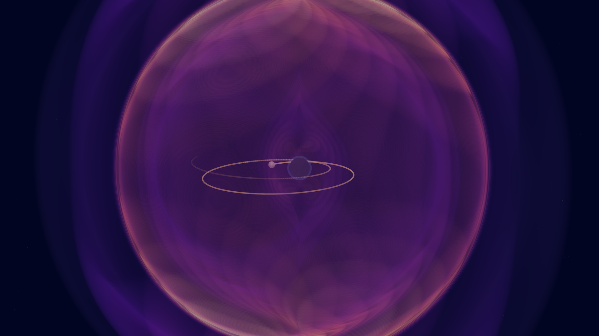
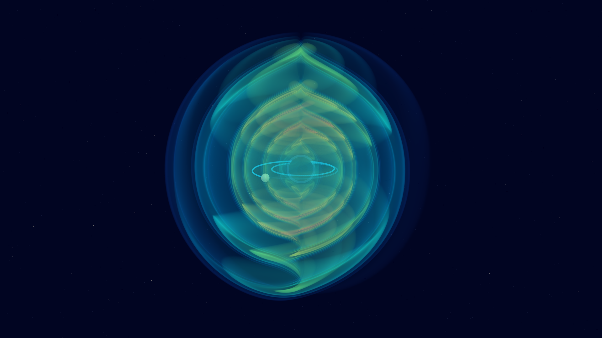
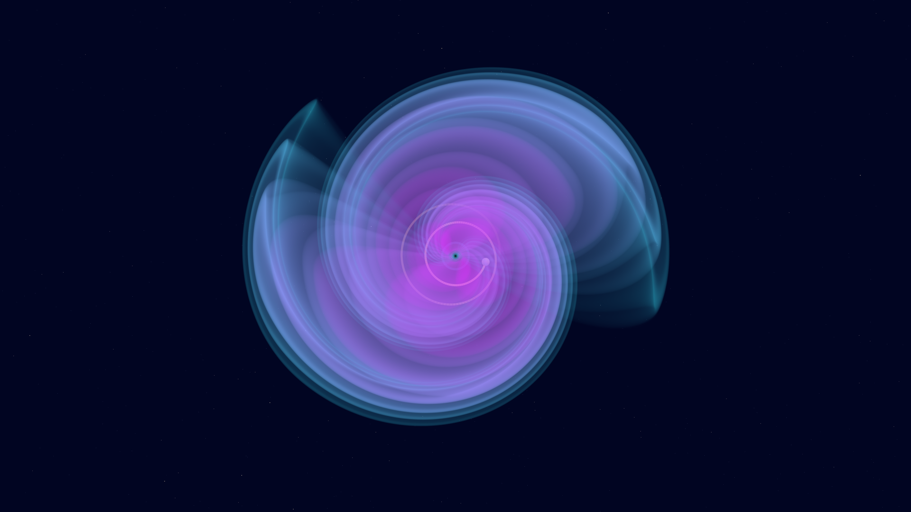
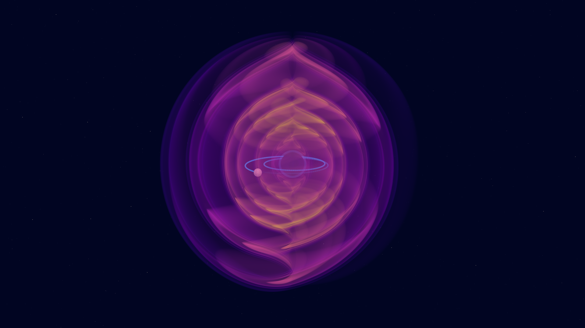
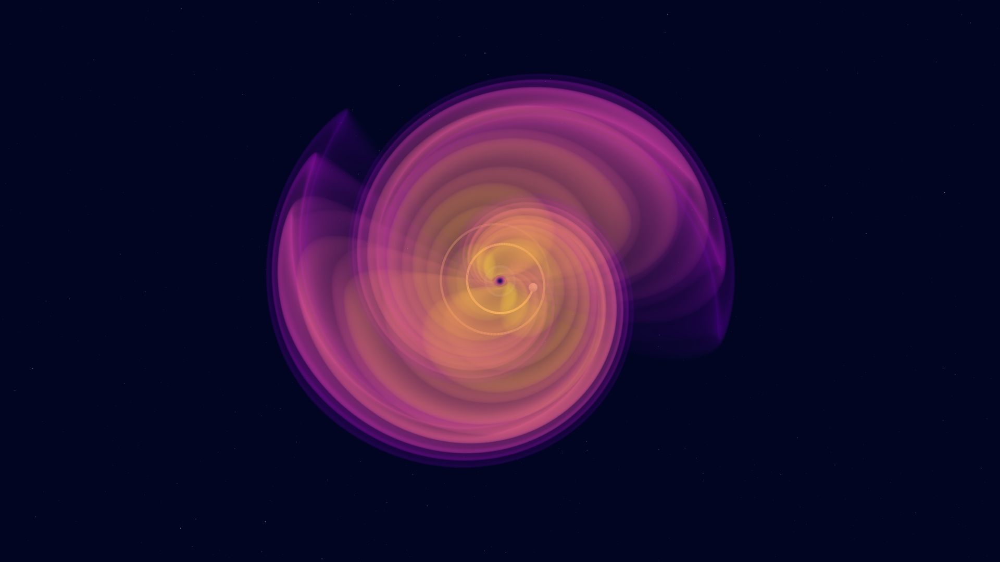
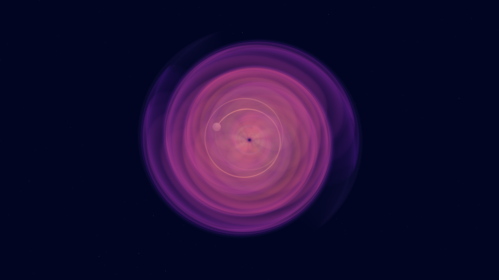

# Fewview

Full-sky volume visualizations for [FastEMRIWaveforms
(FEW)](https://github.com/BlackHolePerturbationToolkit/FastEMRIWaveforms) EMRI
waveforms.

Fewview turns a FEW waveform into a spherical, retarded-time picture of the
gravitational wave. The fully relativistic `FastKerrEccentricEquatorialFlux`
modes are reconstructed into `h_lm(t)`, combined with spin-weighted spherical
harmonics over the whole sky, and evaluated at `u = t_frame - r / c` throughout
a sphere, so a still or movie shows the wave propagating outward from the
source.

## Gallery

A few stills produced with Fewview, across colour palettes and camera views.

<table>
  <tr>
    <td></td>
    <td></td>
  </tr>
  <tr>
    <td align="center"><code>magma</code>, oblique</td>
    <td align="center"><code>rainbow</code>, oblique</td>
  </tr>
  <tr>
    <td></td>
    <td></td>
  </tr>
  <tr>
    <td align="center"><code>cool</code>, face-on</td>
    <td align="center"><code>plasma</code>, oblique</td>
  </tr>
  <tr>
    <td></td>
    <td></td>
  </tr>
  <tr>
    <td align="center"><code>plasma</code>, face-on</td>
    <td align="center"><code>magma</code>, face-on</td>
  </tr>
</table>

## Installation

Fewview reads FEW models directly, so install it into the **same environment**
as your existing FastEMRIWaveforms installation:

```bash
pip install -e .
```

`few` is expected to already be importable; it is not installed as a dependency
so that Fewview does not disturb a working FEW build.

## Documentation

- [Tutorial](docs/tutorial.md) — render a still and a movie, step by step
  (executable version: [`examples/tutorial.ipynb`](examples/tutorial.ipynb))
- [Cluster rendering](docs/cluster_rendering.md) — distributed movies on Slurm

## Quick start

```python
import numpy as np
from fewview import (
    generate_relativistic_mode_waveform,
    choose_max_delay,
    render_mode_frame,
)

wf = generate_relativistic_mode_waveform(
    M=1e6, mu=10.0, a=0.9, p0=12.0, e0=0.4, xI0=1.0,
    dt=10.0, T=0.01, lmax=10, nmax=55,
)
ref = wf.strain(theta=np.pi / 3.0, phi=0.0)
max_delay = choose_max_delay(wf.time, np.real(ref), -np.imag(ref))

render_mode_frame(
    wf,
    screenshot="emri.png",
    max_delay=max_delay,
    frame_time=wf.time[-1],
    waveform_start_time=wf.time[0],
    waveform_end_time=wf.time[-1],
    component="plus",
    opacity_profile="shells",
    color_scheme="rainbow",
)
```

For a movie, use `render_mode_animation` with the same arguments plus a
`start_time`/`end_time` range and `frames`/`fps`.

## Appearance

Three knobs control the look.

**Component** — what scalar field is rendered:

| `component` | meaning | notes |
| --- | --- | --- |
| `plus` | plus polarization | no equatorial node; the usual choice |
| `cross` | cross polarization | zero on the equatorial plane by symmetry |
| `amplitude` | \|h\| | basis-independent, smooth everywhere |
| `energy_flux` | \|dh/dt\|² | pair with the `flux` opacity profile |

**Opacity profile** — how values map to transparency: `soft` (broad fronts,
the default), `bands` (symmetric levels), `shells` (nested translucent
signed-strain sheets; needs `plus`/`cross`), `flux` (log-compressed energy
flux; needs `energy_flux`).

**Colour scheme** — any Matplotlib colormap (`magma`, `viridis`, `plasma`,
`inferno`, `cividis`, `cool`, `blues`) plus three tuned palettes: `rainbow`,
`aurora`, `cinematic`. `fewview.colormaps.available_color_schemes()` lists
them all.

## API layout

The public API is re-exported from the top-level `fewview` package and grouped
into topical submodules:

- `fewview.waveform` — `generate_relativistic_mode_waveform`,
  `RelativisticModeWaveform`, `estimate_waveform_period`, `choose_max_delay`,
  `polarizations_from_complex`
- `fewview.volume` — `build_mode_retarded_time_volume`,
  `RetardedTimeVolume`, `to_pyvista`, `save_volume`
- `fewview.rendering` — `render_volume`, `render_mode_frame`,
  `render_mode_animation`
- `fewview.surface` — `StrainSurface`, `build_strain_surface`,
  `plot_strain_surface`
- `fewview.plotting` — `plot_volume_slice`
- `fewview.colormaps` — palette and profile listings

## Command-line tools

Installing the package provides console scripts:

| command | purpose |
| --- | --- |
| `fewview-render` | render a single still from waveform parameters |
| `fewview-animate` | render a movie from a saved `relativistic-modes.npz` |
| `fewview-cluster-job` | generate a Slurm array job for a cluster render |
| `fewview-cluster-segment` | render one segment of a distributed movie |
| `fewview-cluster-merge` | concatenate rendered segments into the final movie |

See [`docs/cluster_rendering.md`](docs/cluster_rendering.md) for the cluster
workflow.

## Notes on the physics of the picture

- **The polar axis** carries an unavoidable seam: a spin-2 field cannot be
  combed continuously over the poles, so any scalar rendering of `plus`/`cross`
  is multivalued there. It is faint in oblique views and washes out under
  smoothing, but it is inherent to the representation, not a bug.
- **The amplitude model is capped at `nmax=55`.** Requesting a larger `nmax`
  emits a warning and uses the model's trained set; at high eccentricity the
  render will therefore be missing some high-overtone content.

## Acknowledgements

Fewview's volume-rendering approach is inspired by two codes that pioneered this
style of visualization for numerical relativity simulations:

- [**gwpv**](https://github.com/nilsvu/gwpv) by Nils Vu, a ParaView-based
  renderer for gravitational waves from numerical relativity.
- **ROSE**, which renders the radiated field of numerical relativity
  simulations as an outgoing volume.

Fewview adapts that idea to the mode-resolved EMRI waveforms produced by
[FastEMRIWaveforms](https://github.com/BlackHolePerturbationToolkit/FastEMRIWaveforms).

## License

MIT. See [LICENSE](LICENSE).
